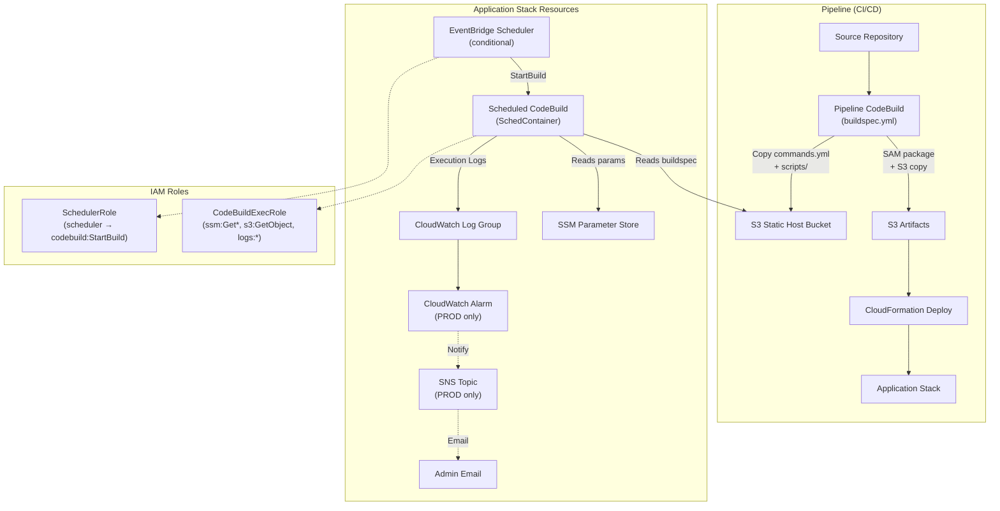
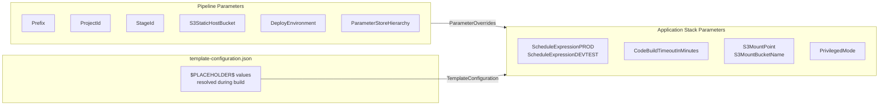

# Design Document: Initial Set-Up

## Overview

This design transforms the application stack from a Lambda/API Gateway serverless web service into a scheduled CodeBuild container workload. The existing `template.yml` contains SAM-based Lambda and API Gateway resources that must be fully replaced with an EventBridge Scheduler-triggered CodeBuild project, supporting IAM roles, CloudWatch logging, and PROD-only alarms.

The architecture follows the Atlantis Platform patterns observed in `template-pipeline.yml`, replicating CodeBuild environment configuration, environment variable conventions, and IAM least-privilege scoping. Two CodeBuild environments coexist: the pipeline CodeBuild (CI/CD via `buildspec.yml`) and the scheduled CodeBuild (recurring workloads via `commands.yml` from S3).

Key design decisions:
- EventBridge Scheduler (`AWS::Scheduler::Schedule`) over EventBridge Rules — newer, AWS-recommended, and the pipeline's CloudFormation service role already has `scheduler:*` permissions scoped to this deployment
- Separate schedule parameters for PROD and DEVTEST, with conditional resource creation when the expression is empty
- PrivilegedMode controlled by a boolean parameter OR auto-enabled when S3 mount parameters are both non-empty
- `DeployRole` parameter retained (unused) with cfn-lint W2001 suppression to avoid pipeline ParameterOverrides failures
- Hardcoded compute (`BUILD_GENERAL1_SMALL`) and image (`aws/codebuild/amazonlinux-x86_64-standard:5.0`) matching the pipeline CodeBuild

## Architecture



### Resource Inventory

| Resource | Type | Condition | Naming |
|---|---|---|---|
| SchedContainer | `AWS::CodeBuild::Project` | Always | `Prefix-ProjectId-StageId-SchedContainer` |
| SchedulerRole | `AWS::IAM::Role` | HasScheduleExpression | `Prefix-ProjectId-StageId-SchedulerRole` |
| CodeBuildExecRole | `AWS::IAM::Role` | Always | `Prefix-ProjectId-StageId-CodeBuildExecRole` |
| Schedule | `AWS::Scheduler::Schedule` | HasScheduleExpression | `Prefix-ProjectId-StageId-Schedule` |
| SchedContainerLogGroup | `AWS::Logs::LogGroup` | Always | `/aws/codebuild/Prefix-ProjectId-StageId-SchedContainer` |
| SchedContainerAlarm | `AWS::CloudWatch::Alarm` | CreateAlarms (PROD) | `Prefix-ProjectId-StageId-SchedContainerAlarm` |
| AlarmNotification | `AWS::SNS::Topic` | CreateAlarms (PROD) | `AWS-Alarm-Prefix-ProjectId-StageId` |

## Components and Interfaces

### 1. CloudFormation Template (`template.yml`)

#### Parameters (Retained)
- `Prefix`, `ProjectId`, `StageId`, `S3BucketNameOrgPrefix` — resource naming
- `RolePath`, `PermissionsBoundaryArn` — IAM configuration
- `DeployEnvironment` — PROD/TEST/DEV conditional logic
- `ParameterStoreHierarchy` — SSM path prefix
- `AlarmNotificationEmail` — alarm notification target
- `LogRetentionInDaysForPROD`, `LogRetentionInDaysForDEVTEST` — log retention
- `DeployRole` — retained unused, cfn-lint W2001 suppressed

#### Parameters (New)
- `ScheduleExpressionPROD` (String, default: `cron(0 6 * * ? *)`) — PROD schedule
- `ScheduleExpressionDEVTEST` (String, default: `""`) — DEVTEST schedule
- `CodeBuildTimeoutInMinutes` (Number, default: 10, min: 5, max: 480) — build timeout
- `S3StaticHostBucket` (String) — S3 bucket for commands.yml and scripts
- `S3MountPoint` (String, default: `""`) — optional S3 mount path
- `S3MountBucketName` (String, default: `""`) — optional S3 bucket to mount
- `PrivilegedMode` (String, default: `"false"`, AllowedValues: `["true", "false"]`) — enable elevated permissions

#### Parameters (Removed)
- `FunctionTimeOutInSeconds`, `FunctionMaxMemoryInMB`, `FunctionArchitecture`
- `FunctionGradualDeploymentType`, `ApiPathBase`, `ApiGatewayLoggingEnabled`

#### Conditions
- `IsProduction` — retained
- `HasPermissionsBoundaryArn` — retained
- `CreateAlarms` — retained (PROD only)
- `HasScheduleExpression` (NEW) — true when the resolved schedule expression (PROD or DEVTEST based on environment) is non-empty
- `EnablePrivilegedMode` (NEW) — true when `PrivilegedMode` is `"true"` OR both `S3MountPoint` and `S3MountBucketName` are non-empty
- Removed: `ApiGatewayLoggingIsEnabled` and all Lambda/API Gateway conditions

#### Globals
- Remove the `Globals` section entirely (was only for API Gateway `OpenApiVersion`)

#### Resources (Removed)
- `WebApi`, `ApiGatewayAccessLogGroup`, `ApiGatewayExecutionLogGroup`
- `AppFunction`, `LambdaExecutionRole`, `ConfigLambdaPermission`, `ConfigLambdaPermissionLive`
- `AppFunctionErrorsAlarm`, `AppFunctionErrorAlarmNotification`, `AppLogGroup`

#### Resources (New)

**SchedContainer** (`AWS::CodeBuild::Project`):
- Name: `Prefix-ProjectId-StageId-SchedContainer`
- ServiceRole: `CodeBuildExecRole.Arn`
- Source: `NO_SOURCE` type with buildspec from S3 (`S3StaticHostBucket/Prefix-ProjectId-StageId/commands.yml`)
- Environment: `BUILD_GENERAL1_SMALL`, `LINUX_CONTAINER`, `aws/codebuild/amazonlinux-x86_64-standard:5.0`
- PrivilegedMode: uses `EnablePrivilegedMode` condition
- TimeoutInMinutes: `CodeBuildTimeoutInMinutes` parameter
- Environment variables matching pipeline CodeBuild: `PREFIX`, `PROJECT_ID`, `STAGE_ID`, `PARAM_STORE_HIERARCHY`, `DEPLOY_ENVIRONMENT`, `S3_MOUNT_POINT`, `S3_BUCKET_NAME`
- LogsConfig pointing to the dedicated log group

**CodeBuildExecRole** (`AWS::IAM::Role`):
- Trust: `codebuild.amazonaws.com`
- Policies:
  - `ssm:GetParameter`, `ssm:GetParametersByPath` scoped to `ParameterStoreHierarchy` path
  - `s3:GetObject` scoped to `S3StaticHostBucket` and `Prefix-ProjectId-StageId/*` path
  - `logs:CreateLogGroup`, `logs:CreateLogStream`, `logs:PutLogEvents` scoped to log group ARN

**SchedulerRole** (`AWS::IAM::Role`, conditional on `HasScheduleExpression`):
- Trust: `scheduler.amazonaws.com`
- Policy: `codebuild:StartBuild` scoped to SchedContainer project ARN

**Schedule** (`AWS::Scheduler::Schedule`, conditional on `HasScheduleExpression`):
- ScheduleExpression: resolved from PROD or DEVTEST parameter based on environment
- Target: CodeBuild `StartBuild` on SchedContainer
- RoleArn: SchedulerRole

**SchedContainerLogGroup** (`AWS::Logs::LogGroup`):
- LogGroupName: `/aws/codebuild/Prefix-ProjectId-StageId-SchedContainer`
- RetentionInDays: conditional on environment

**SchedContainerAlarm** (`AWS::CloudWatch::Alarm`, PROD only):
- Metric: `FailedBuilds` on `AWS/CodeBuild` namespace
- Dimension: ProjectName = SchedContainer
- AlarmActions: SNS topic

**AlarmNotification** (`AWS::SNS::Topic`, PROD only):
- DisplayName: `AWS-Alarm-Prefix-ProjectId-StageId`
- Subscription: email to `AlarmNotificationEmail`

#### Outputs (New)
- `CloudWatchSchedContainerLogGroup` — link to CodeBuild log group
- `ParameterStore` — link to SSM parameters (retained from original)

### 2. Pipeline Buildspec (`buildspec.yml`)

Add S3 copy commands in the build phase (after `cd application-infrastructure`):

```yaml
# Copy commands.yml and scripts to S3 Static Host Bucket
- aws s3 cp src/commands.yml s3://$S3_STATIC_HOST_BUCKET/$PREFIX-$PROJECT_ID-$STAGE_ID/commands.yml
- aws s3 cp src/scripts/ s3://$S3_STATIC_HOST_BUCKET/$PREFIX-$PROJECT_ID-$STAGE_ID/scripts/ --recursive
```

### 3. Commands File (`commands.yml`)

Add an example AWS CLI command in the build phase to read the SSM parameter:

```yaml
- aws ssm get-parameter --name "${PARAM_STORE_HIERARCHY}ExampleParameter" --query "Parameter.Value" --output text
```

### 4. Template Configuration (`template-configuration.json`)

Add parameter entries using `$PLACEHOLDER$` convention for values resolved from pipeline environment variables. Do NOT add `S3MountPoint` or `S3MountBucketName` (those are set directly in the template with empty defaults).

New parameter entries:
- `S3StaticHostBucket`: `$S3_STATIC_HOST_BUCKET$`

### 5. Documentation

**DEPLOYMENT.md**: Add prerequisites section covering:
- S3 DevOps bucket deployment via `template-storage-s3-devops.yml` with `BuildSourceArn` set to pipeline CodeBuild ARN
- `S3StaticHostBucket` parameter passed to pipeline
- CodeBuild managed policy via `CloudFormationSvcRoleIncludeManagedPolicyArns`

**docs/developer/**: S3 mounting, S3 copy/sync, repo cloning, AWS CLI usage, PrivilegedMode notes

**docs/admin-ops/**: Runtime environments for both CodeBuilds, compute/image changes, timeout configuration

**docs/end-user/**: Sparse template structure for application-specific content

## Data Models

### CloudFormation Parameters Flow



### Environment Variables (Scheduled CodeBuild)

| Variable | Source | Description |
|---|---|---|
| `PREFIX` | `!Ref Prefix` | Team/org identifier |
| `PROJECT_ID` | `!Ref ProjectId` | Application identifier |
| `STAGE_ID` | `!Ref StageId` | Branch/stage alias |
| `PARAM_STORE_HIERARCHY` | `!Sub` of ParameterStoreHierarchy + DeployEnvironment + naming | Full SSM path prefix |
| `DEPLOY_ENVIRONMENT` | `!Ref DeployEnvironment` | PROD, TEST, or DEV |
| `S3_MOUNT_POINT` | `!Ref S3MountPoint` | Optional S3 mount path |
| `S3_BUCKET_NAME` | `!Ref S3MountBucketName` | Optional S3 bucket to mount |

### IAM Permission Scoping

| Role | Service | Actions | Resource Scope |
|---|---|---|---|
| CodeBuildExecRole | SSM | `GetParameter`, `GetParametersByPath` | `arn:aws:ssm:REGION:ACCOUNT:parameter{hierarchy}*` |
| CodeBuildExecRole | S3 | `GetObject` | `arn:aws:s3:::S3StaticHostBucket/Prefix-ProjectId-StageId/*` |
| CodeBuildExecRole | Logs | `CreateLogGroup`, `CreateLogStream`, `PutLogEvents` | Log group ARN |
| SchedulerRole | CodeBuild | `StartBuild` | SchedContainer project ARN |


## Error Handling

### CloudFormation Deployment Errors

| Error Scenario | Cause | Resolution |
|---|---|---|
| Stack creation fails on CodeBuild project | Missing CodeBuild managed policy on CloudFormation service role | Add managed policy via `CloudFormationSvcRoleIncludeManagedPolicyArns` |
| Stack creation fails on Scheduler | Missing scheduler permissions | Pipeline's CloudFormation service role already has `scheduler:*` scoped to this deployment |
| cfn-lint W2001 on DeployRole | Unused parameter | Suppressed via metadata annotation on the parameter |
| S3 access denied during CodeBuild | Missing `BuildSourceArn` on S3 DevOps bucket | Update S3 bucket policy with pipeline CodeBuild ARN |

### Runtime Errors

| Error Scenario | Cause | Resolution |
|---|---|---|
| CodeBuild fails to start | Invalid buildspec path in S3 | Verify `commands.yml` was copied to `S3StaticHostBucket/Prefix-ProjectId-StageId/commands.yml` |
| S3 mount fails | PrivilegedMode not enabled | Set `PrivilegedMode` parameter to `true` or provide both `S3MountPoint` and `S3MountBucketName` |
| SSM parameter read fails | Insufficient permissions or parameter doesn't exist | Verify parameter exists at `PARAM_STORE_HIERARCHY` path; check CodeBuildExecRole policy |
| Schedule not triggering | Empty schedule expression | Verify `ScheduleExpressionPROD` or `ScheduleExpressionDEVTEST` is non-empty for the target environment |
| Alarm not created | Non-PROD environment | Alarms and SNS topics are PROD-only by design |

### Condition Logic Edge Cases

- When `PrivilegedMode` is `"false"` but both S3 mount params are provided → PrivilegedMode is auto-enabled (OR logic)
- When `PrivilegedMode` is `"true"` but S3 mount params are empty → PrivilegedMode is enabled (parameter override)
- When schedule expression is empty → no Scheduler or SchedulerRole resources are created
- When `DeployEnvironment` is `DEV` → no alarms, shorter log retention, schedule likely disabled

## Testing Strategy

### Why Property-Based Testing Does Not Apply

This feature consists entirely of Infrastructure as Code (CloudFormation templates), build specifications (YAML), configuration files (JSON), and documentation (Markdown). There are no pure functions, parsers, serializers, or business logic with meaningful input variation. PBT is not appropriate for:
- CloudFormation template definitions — declarative configuration, not functions
- Buildspec commands — shell commands with fixed behavior
- Template configuration — static JSON with placeholder substitution
- Documentation — prose content

### Recommended Testing Approach

**CloudFormation Template Validation:**
- `aws cloudformation validate-template` for syntax validation
- `cfn-lint` for best-practice linting (with W2001 suppression for DeployRole)
- Manual review of IAM policies for least-privilege compliance

**Deployment Smoke Tests:**
- Deploy to TEST environment and verify stack creates successfully
- Verify CodeBuild project exists with correct configuration
- Verify log group is created with correct retention
- Verify no Scheduler resources when schedule expression is empty
- Verify Scheduler resources when schedule expression is non-empty

**Integration Tests:**
- Trigger CodeBuild manually and verify it reads `commands.yml` from S3
- Verify SSM parameter read succeeds from within CodeBuild
- Verify S3 mount works when PrivilegedMode is enabled with mount parameters
- Verify PROD deployment creates alarm and SNS topic
- Verify TEST deployment does NOT create alarm or SNS topic

**Buildspec Verification:**
- Deploy pipeline and verify `commands.yml` and `scripts/` are copied to S3 during build phase
- Verify the S3 path structure matches `S3StaticHostBucket/Prefix-ProjectId-StageId/`

**Documentation Review:**
- Verify DEPLOYMENT.md contains prerequisite instructions
- Verify docs/developer/ covers S3 mounting, copy/sync, repo cloning, AWS CLI, PrivilegedMode
- Verify docs/admin-ops/ covers runtime environments for both CodeBuilds
- Verify docs/end-user/ has template structure
