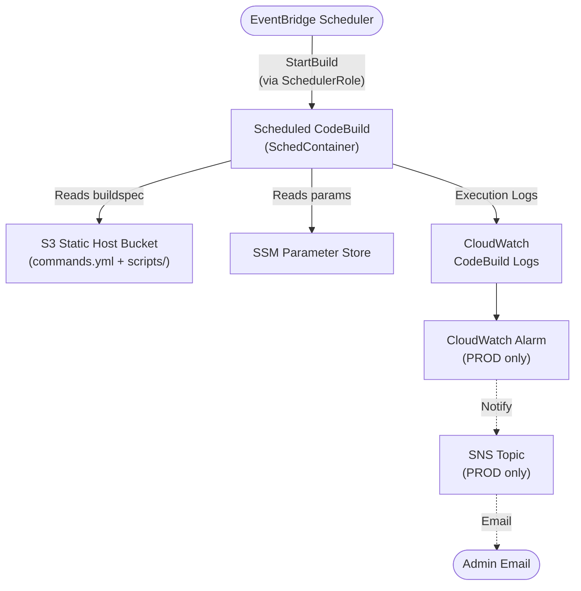
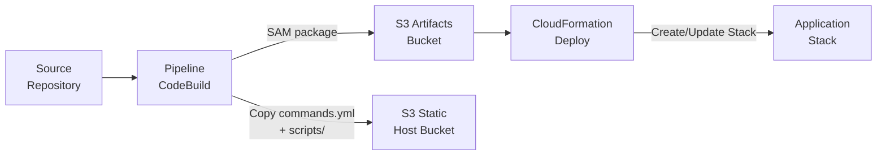

# Architecture

## Directory Structure

```
├── application-infrastructure/    # AWS SAM application stack
│   ├── build-scripts/             # Scripts used during CodeBuild (Pipeline)
│   │   ├── generate-put-ssm.py
│   │   └── update_template_configuration.py
│   ├── src/                       # Commands and Scripts for Scheduled Container
│   │   ├── scripts/               # Scripts for CodeBuild Container
│.  │   └── commands.yml           # Commands for CodeBuild Container
│   ├── buildspec.yml              # AWS CodeBuild build specification
│   ├── template.yml               # AWS SAM/CloudFormation template
│   └── template-configuration.json # Stack parameter overrides
├── docs/                          # Documentation
│   ├── admin-ops/                 # For Admin, Operations
│   ├── developer/                 # For Developer maintaining application
│   └── end-user/                  # For consumer of this application's output (Exported reports)
├── scripts/                       # Utility scripts ran by developer (Not part of deployment)
│   └── generate-sidecar-metadata.py
├── AGENTS.md                      # AI and developer guidelines
├── CHANGELOG.md
├── DEPLOYMENT.md
├── ARCHITECTURE.md
└── README.md
```

## Application Stack



## Deployment Pipeline



## Key Design Decisions

- **EventBridge Scheduler** (not EventBridge Rules) is used for scheduling — newer, AWS-recommended, and the pipeline's CloudFormation service role already has `scheduler:*` permissions scoped to this deployment.
- **Conditional resource creation** — Scheduler and SchedulerRole are only created when the schedule expression is non-empty; Alarm and SNS Topic are only created in PROD.
- **PrivilegedMode auto-enable logic** — PrivilegedMode is enabled when the parameter is `true` OR when both `S3MountPoint` and `S3MountBucketName` are non-empty.
- **Separate schedule expressions** for PROD (`ScheduleExpressionPROD`) and DEVTEST (`ScheduleExpressionDEVTEST`) allow independent scheduling per environment.
- **CloudWatch Alarms** and SNS notifications are created only in PROD to reduce cost.
- **Permissions Boundary** support is optional, controlled via a stack parameter.
